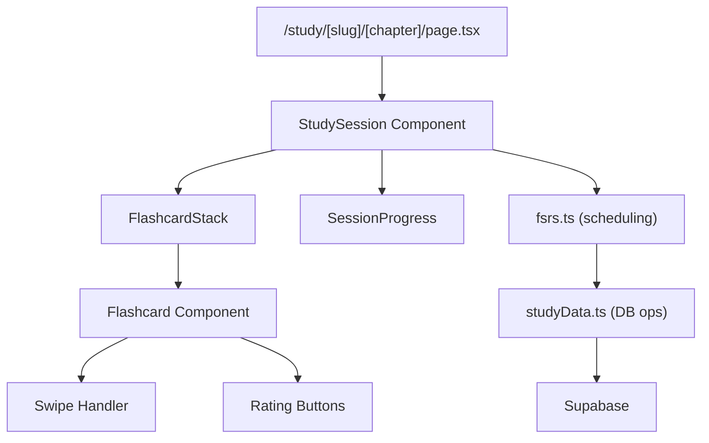

# Study Feature Implementation Plan

## Overview

Create a flashcard study interface at `/study/{series-slug}/{chapter-number}` using FSRS algorithm. Cards show Korean term first, reveal English definition on tap. Session limits: 10 new + 20 review cards. Supports swipe gestures and button clicks.

## Architecture

## Key Files to Create

### 1. Study Page (Server Component)

`src/app/study/[slug]/[chapter]/page.tsx`

- Fetch chapter vocabulary + user's SRS cards
- Calculate which cards are due/new
- Pass initial data to client components

### 2. Study Session Component

`src/components/study/studySession.tsx`

- Client component managing session state
- Tracks current card index, answered count
- Handles session completion

### 3. Flashcard Component

`src/components/study/flashcard.tsx`

- Shows Korean term (front)
- Tap/click to reveal English definition (back)
- Animated flip transition
- Swipe gestures for rating (left=Again, down=Hard, right=Good, up=Easy)

### 4. Rating Buttons

`src/components/study/ratingButtons.tsx`

- Again / Hard / Good / Easy buttons
- Shows next review interval preview

### 5. FSRS Service

`src/lib/study/fsrs.ts`

- Implements FSRS-5 algorithm
- Calculates next review dates
- Uses existing `srs_progress_logs` table structure

### 6. Study Data Service

`src/lib/study/studyData.ts`

- Get due cards for user
- Create/update SRS cards
- Log study sessions
- Update progress summaries

## Database Usage

Leverages existing tables:

- `user_deck_srs_cards` - Per-card SRS state
- `srs_progress_logs` - Review history with FSRS fields
- `user_chapter_progress_summary` - Aggregate stats
- `user_chapter_study_sessions` - Session logs

## Session Flow

1. User navigates to `/study/solo-leveling/1`
2. Server fetches vocabulary + user SRS data
3. FSRS service selects cards: up to 10 new + 20 due
4. Cards rendered in shuffled order
5. User taps card to flip, then rates
6. Rating updates SRS state via API
7. On completion, show summary + "Continue" button

## Guest Handling

- Guest users can study via supabase anon/guest auth
- Warning banner explains progress may not sync