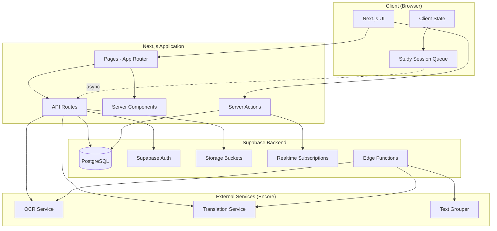
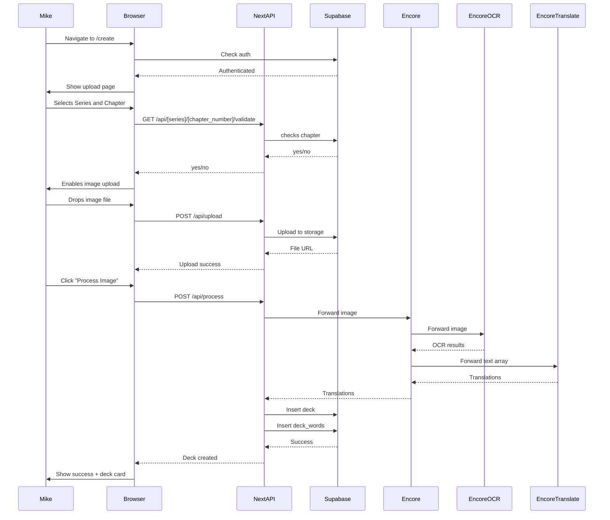

# AnkiToon Rebuild - Comprehensive Documentation

**Project:** AnkiToon (formerly Webtoon2Anki)  
**Purpose:** Korean language learning platform via webtoon vocabulary flashcards  
**Rebuild:** Next.js 14+ with Supabase, preserving backend services  
**Date:** December 2025
**Version:** 3.0

---

## Table of Contents

1. [Project Overview](#project-overview)
2. [Existing Codebase Analysis](#existing-codebase-analysis)
3. [Architecture & Data Model](#architecture--data-model)
4. [Type Definitions](#type-definitions)
5. [User Stories & Journeys](#user-stories--journeys)
6. [Implementation Patterns](#implementation-patterns)
7. [Migration Guide](#migration-guide)
8. [API Reference](#api-reference)

---

## Project Overview

### What is AnkiToon?

AnkiToon is a language learning platform that enables users to study Korean vocabulary through:

- **Pre-made decks** generated from popular webtoon series
- **Custom deck creation** by uploading webtoon screenshots
- **Spaced repetition study** using FSRS algorithm
- **Progress tracking** with analytics dashboard
- **Series management** organized by webtoon titles

### Current State

The existing project includes:

- CLI tool (`w2a`) for deck/series/study management
- Encore.ts backend services (OCR, translation, text grouping)
- Supabase database schema with SRS tracking
- Comprehensive SRS algorithm research and implementation
- Migration files for PostgreSQL database

### Rebuild Goals

- Modern Next.js 14+ web application with App Router
- Supabase for database, auth, storage, and edge functions
- Preserve valuable backend services (OCR, translation)
- Reuse database schema and business logic
- Fresh start (no data migration)

---

## Existing Codebase Analysis

### Valuable Files & Folders to Preserve

#### 🟢 High Value - Reuse Directly

**Database Migrations** (`/migrations/`)

All SQL files should be copied to your Supabase project:

1. **`2024-05-19_create_decks.sql`** - Core deck structure
   - decks table with user_id, chapter_id relationships
   - Indexes for performance
   
2. **`2024-05-19_create_deck_words.sql`** - SRS tracking schema
   - SM-2/FSRS fields: state, interval, e_factor
   - Progress tracking: consecutive_correct, total_reviews, next_review_date
   - Unique constraint: (deck_id, word_id, user_id)
   
3. **`2024-06-09_create_user_chapter_progress.sql`** - Per-chapter progress
   - Cards studied, accuracy, time spent
   - Streak tracking, completion status
   
4. **`2024-06-09_create_user_series_progress.sql`** - Per-series progress
   - Aggregated statistics across chapters
   - Overall progress tracking
   
5. **`2025-08-13_rpc.sql`** - RPC function for chapter cards
   - `get_chapter_cards()` function
   - Joins series, chapters, words, fsrs_progress

**TypeScript Types** (`/cli/types/index.ts`)

```typescript
export type Series = {
  id: string;
  title: string;
  genre?: string;
  language?: string;
  createdAt: string;
};

export type Chapter = {
  id: string;
  seriesId: string;
  number: number;
  title?: string;
  sourceFile?: string;
  private?: boolean;
  difficulty?: string;
  unlocked: boolean;
  createdAt: string;
};

export type Card = {
  id: string;
  chapterId: string;
  word: string;
  definition: string;
  romanization?: string;
  example?: string;
  createdAt: string;
};

export type User = {
  id: string;
  username: string;
  email?: string;
  avatar?: string;
  guest?: boolean;
  createdAt: string;
};

export type Deck = {
  id: string;
  title: string;
  genre?: string;
  difficulty?: string;
  status?: string;
  featured?: string[];
  createdAt: string;
};

```
Study session flow:
1. Start session → load queues by state
2. Present card from appropriate queue
3. User rates card (1-4)
4. **Immediately show next card** (optimistic UI)
5. **Async update** FSRS progress in background
6. End session → save remaining progress

#### 🟡 Medium Value - Adapt & Refactor

**CLI Command Patterns**

These files contain solid business logic that should inform your API design:

1. **`cli/commands/series.ts`** - Series CRUD
   - List all series
   - Create new series
   - Search by query
   - API pattern: `GET /supabase/series`, `POST /supabase/series`

2. **`cli/commands/deck.ts`** - Deck management
   - List decks with filters
   - Create deck from chapter
   - View deck details with cards
   - Get due cards for review
   - Feature/badge system

3. **`cli/commands/card.ts`** - Vocabulary operations
   - Add cards to chapter
   - Edit card definitions
   - Delete cards
   - List cards for chapter

4. **`cli/commands/chapter.ts`** - Chapter management
   - Add chapter to series
   - List chapters for series

5. **`cli/commands/user.ts`** - User operations
   - Create user
   - Login simulation
   - View progress
   - Reset progress

6. **`cli/commands/study.ts`** - Study session logic
   - Session state management
   - Queue-based card presentation
   - Rating submission
   - Progress tracking

**Key patterns to extract:**

```typescript
// API request wrapper
async function apiRequest(method, path, data, options) {
  const response = await fetch(baseUrl + path, {
    method,
    headers: { 'Content-Type': 'application/json' },
    body: data ? JSON.stringify(data) : undefined
  })
  return response.json()
}

// Output formatting (adapt for web UI)
function printTable(data) {
  // Convert to table component
}

function printJson(data) {
  // Convert to JSON viewer component
}
```

**Documentation Files**

Valuable context and decisions:

- **`.cursor/PRD.md`** - Product requirements, target users, success metrics
- **`.cursor/docs/30-srs-algorithm-research.md`** - Extensive SRS research
- **`.cursor/docs/34-srs-algorithm-design-decisions.md`** - Why certain choices were made
- **`.cursor/docs/27-project-context-and-history.md`** - Development history
- **`.cursor/docs/29-feature-roadmap-and-prioritization.md`** - Future features
- **`.cursor/new-stories.md`** - Additional user stories for future

**Backend Service Structure** (`/backend/`)

Services to keep running separately:

```
backend/
├── services/
│   ├── ocr-api/          # Google Cloud Vision integration
│   ├── translation/      # Papago translation engine
│   ├── text-grouper/     # Dialogue extraction from OCR
│   ├── anki/             # Anki package generation (deprecated)
│   ├── storage/          # Temp file storage
│   └── validation/       # File validation
```

**Keep these Encore services:**
- OCR processing (complex image processing pipeline)
- Translation (Papago API integration)
- Text grouping (speech bubble detection)

**Deprecate/replace:**
- Anki package generation (no longer needed)
- File validation (Next.js can handle)
- Storage service (use Supabase Storage)

#### 🔴 Low Value - Recreate for Web

- CLI infrastructure (Commander, Inquirer)
- Terminal output formatting
- Config file management (replace with env vars)
- Old API client (Axios → modern fetch/SWR)

---

## Architecture & Data Model

### System Architecture



### Database Schema

#### Core Tables

**series**

```sql
CREATE TABLE series (
  id UUID PRIMARY KEY DEFAULT gen_random_uuid(),
  name TEXT NOT NULL,
  korean_name TEXT,
  alt_names TEXT[]
  slug TEXT UNIQUE NOT NULL,
  picture_url TEXT,
  synopsis TEXT,
  popularity INTEGER,
  genres TEXT[],
  authors TEXT[],
  num_chapters INTEGER NOT NULL,
  created_at TIMESTAMP WITH TIME ZONE DEFAULT NOW(),
  updated_at TIMESTAMP WITH TIME ZONE DEFAULT NOW()
);

CREATE INDEX idx_series_slug ON series(slug);
CREATE INDEX idx_series_popularity ON series(popularity DESC);
```

**chapters**

```sql
CREATE TABLE chapters (
  id UUID PRIMARY KEY DEFAULT gen_random_uuid(),
  series_id UUID NOT NULL REFERENCES series(id) ON DELETE CASCADE,
  chapter_number INTEGER NOT NULL,
  title TEXT,
  created_at TIMESTAMP WITH TIME ZONE DEFAULT NOW(),
  UNIQUE (series_id, chapter_number)
);

CREATE INDEX idx_chapters_series_id ON chapters(series_id);
```

**vocabulary**

```sql
CREATE TABLE vocabulary (
  id UUID PRIMARY KEY DEFAULT gen_random_uuid(),
  term TEXT NOT NULL,
  definition TEXT NOT NULL,
  example TEXT,
  created_at TIMESTAMP WITH TIME ZONE DEFAULT NOW()
);

CREATE INDEX idx_vocabulary_term ON vocabulary(term);
```

**chapter_vocabulary** (join table)

```sql
CREATE TABLE chapter_vocabulary (
  id UUID PRIMARY KEY DEFAULT gen_random_uuid(),
  chapter_id UUID NOT NULL REFERENCES chapters(id) ON DELETE CASCADE,
  vocabulary_id UUID NOT NULL REFERENCES words(id) ON DELETE CASCADE,
  importance_score INTEGER DEFAULT 0,
  UNIQUE (chapter_id, vocabulary_id)
);

CREATE INDEX idx_chapter_vocab_word ON chapter_vocabulary(vocabulary_id);
CREATE INDEX idx_chapter_vocavulary_chapter_id ON chapter_vocabulary(chapter_id);
```

**user_chapter_decks**

```sql
CREATE TABLE user_chapter_decks (
  id UUID PRIMARY KEY DEFAULT gen_random_uuid(),
  name TEXT NOT NULL,
  user_id UUID NOT NULL REFERENCES auth.users(id) ON DELETE CASCADE,
  chapter_id UUID REFERENCES chapters(id) ON DELETE SET NULL,
  created_at TIMESTAMP WITH TIME ZONE DEFAULT NOW(),
  updated_at TIMESTAMP WITH TIME ZONE DEFAULT NOW()
);

CREATE INDEX idx_user_chapter_decks_user_id ON user_chapter_decks(user_id);
CREATE INDEX idx_user_chapter_decks_chapter_id ON user_chapter_decks(chapter_id);
```

**user_deck_srs_cards** (SRS tracking - SM-2 style)

```sql
CREATE TYPE srs_state AS ENUM ('new', 'learning', 'reviewing', 'mastered');

CREATE TABLE user_deck_srs_cards (
  id UUID PRIMARY KEY DEFAULT gen_random_uuid(),
  deck_id UUID NOT NULL REFERENCES user_chapter_decks(id) ON DELETE CASCADE,
  vocabulary_id UUID NOT NULL REFERENCES vocabulary(id) ON DELETE CASCADE,
  user_id UUID NOT NULL REFERENCES auth.users(id) ON DELETE CASCADE,
  
  -- SRS/SM-2 fields
  state srs_state NOT NULL DEFAULT 'new',
  review_interval_days INTEGER NOT NULL DEFAULT 0,
  ease_factor REAL NOT NULL DEFAULT 2.5,
  streak_correct INTEGER NOT NULL DEFAULT 0,
  streak_incorrect INTEGER NOT NULL DEFAULT 0,
  total_reviews INTEGER NOT NULL DEFAULT 0,
  next_review_date TIMESTAMP WITH TIME ZONE,
  last_reviewed_date TIMESTAMP WITH TIME ZONE,
  first_seen_date TIMESTAMP WITH TIME ZONE,
  
  created_at TIMESTAMP WITH TIME ZONE DEFAULT NOW(),
  updated_at TIMESTAMP WITH TIME ZONE DEFAULT NOW(),
  
  UNIQUE (deck_id, vocabulary_id, user_id)
);

CREATE INDEX idx_user_deck_srs_cards_deck_id ON user_deck_srs_cards(deck_id);
CREATE INDEX idx_user_deck_srs_cards_user_id ON user_deck_srs_cards(user_id);
CREATE INDEX idx_user_deck_srs_cards_next_review ON user_deck_srs_cards(user_id, next_review_date)
  WHERE next_review_date IS NOT NULL;
```

**srs_progress_log** (Alternative FSRS tracking)

```sql
CREATE TABLE srs_progress_logs (
  id UUID PRIMARY KEY DEFAULT gen_random_uuid(),
  user_id UUID NOT NULL REFERENCES auth.users(id),
  vocabulary_id UUID NOT NULL REFERENCES vocabulary(id),
  srs_card_id UUID REFERENCES user_deck_srs_cards(id),
  
  -- FSRS fields
  due TIMESTAMP WITH TIME ZONE NOT NULL,
  stability REAL NOT NULL,
  difficulty REAL NOT NULL,
  elapsed_days INTEGER NOT NULL DEFAULT 0,
  scheduled_days INTEGER NOT NULL DEFAULT 0,
  learning_steps JSONB,
  reps INTEGER NOT NULL DEFAULT 0,
  lapses INTEGER NOT NULL DEFAULT 0,
  state srs_state NOT NULL DEFAULT 'new',
  last_review TIMESTAMP WITH TIME ZONE,
  
  created_at TIMESTAMP WITH TIME ZONE DEFAULT NOW(),
);

CREATE INDEX idx_srs_progress_logs_user_id ON srs_progress_logs(user_id)
```

**user_chapter_progress_summary**
```sql
CREATE TABLE user_chapter_progress_summary (
  id UUID PRIMARY KEY DEFAULT gen_random_uuid(),
  user_id UUID NOT NULL REFERENCES auth.users(id) ON DELETE CASCADE,
  series_id UUID NOT NULL REFERENCES series(id) ON DELETE CASCADE,
  chapter_id UUID NOT NULL REFERENCES chapters(id) ON DELETE CASCADE,
  
  cards_studied INTEGER DEFAULT 0,
  total_cards INTEGER DEFAULT 0,
  accuracy REAL DEFAULT 0,
  time_spent_seconds INTEGER DEFAULT 0,
  current_streak INTEGER DEFAULT 0,
  completed BOOLEAN DEFAULT FALSE,
  last_studied TIMESTAMP,
  first_studied TIMESTAMP,
  
  created_at TIMESTAMP DEFAULT NOW(),
  updated_at TIMESTAMP DEFAULT NOW(),
  
  UNIQUE (user_id, chapter_id)
);

-- Indexes for fast lookup
CREATE INDEX idx_ucps_user ON user_chapter_progress_summary(user_id);
CREATE INDEX idx_ucps_chapter ON user_chapter_progress_summary(chapter_id);
CREATE INDEX idx_ucps_user_series ON user_chapter_progress_summary(user_id, series_id);
```

**user_chapter_study_sessions**
```sql
CREATE TABLE user_chapter_study_sessions (
  id UUID PRIMARY KEY DEFAULT gen_random_uuid(),
  user_id UUID NOT NULL REFERENCES auth.users(id) ON DELETE CASCADE,
  chapter_id UUID NOT NULL REFERENCES chapters(id) ON DELETE CASCADE,
  deck_id UUID REFERENCES user_chapter_decks(id), -- optional
  cards_studied INTEGER NOT NULL,
  accuracy REAL NOT NULL,
  time_spent_seconds INTEGER NOT NULL,
  studied_at TIMESTAMP NOT NULL DEFAULT NOW(),
);

CREATE INDEX idx_ucss_user_chapter ON user_chapter_study_sessions(user_id, chapter_id);
CREATE INDEX idx_ucss_studied_at ON user_chapter_study_sessions(studied_at DESC);
```


**user_series_progress_summary**
```sql
CREATE TABLE user_series_progress_summary (
  id UUID PRIMARY KEY DEFAULT gen_random_uuid(),
  user_id UUID NOT NULL REFERENCES auth.users(id) ON DELETE CASCADE,
  series_id UUID NOT NULL REFERENCES series(id) ON DELETE CASCADE,
  
  chapters_completed INTEGER DEFAULT 0,
  total_chapters INTEGER DEFAULT 0,
  cards_studied INTEGER DEFAULT 0,
  total_cards INTEGER DEFAULT 0,
  current_streak INTEGER DEFAULT 0,
  last_studied TIMESTAMP,
  average_accuracy REAL DEFAULT 0,
  total_time_spent_seconds INTEGER DEFAULT 0,
  
  created_at TIMESTAMP DEFAULT NOW(),
  updated_at TIMESTAMP DEFAULT NOW(),
  
  UNIQUE(user_id, series_id)
);

CREATE INDEX idx_user_series_progress_user ON user_series_progress(user_id);
CREATE INDEX idx_user_series_progress_series ON user_series_progress(series_id);
```

### Row Level Security (RLS) Policies

```sql
-- Users can only see their own decks
ALTER TABLE user_chapter_decks ENABLE ROW LEVEL SECURITY;

CREATE POLICY "Users can view own decks"
  ON user_chapter_decks FOR SELECT
  USING (auth.uid() = user_id);

CREATE POLICY "Users can create own decks"
  ON user_chapter_decks FOR INSERT
  WITH CHECK (auth.uid() = user_id);

-- Users can only update their own progress
ALTER TABLE deck_words ENABLE ROW LEVEL SECURITY;

CREATE POLICY "Users can view own progress"
  ON srs_progress_logs FOR SELECT
  USING (auth.uid() = user_id);

CREATE POLICY "Users can insert own progress"
  ON srs_progress_logs FOR INSERT
  USING (auth.uid() = user_id);

-- Similar policies for other user-specific tables
```

---

## Type Definitions

### Enhanced TypeScript Types for Next.js

```typescript
// Database types
export type Database = {
  public: {
    Tables: {
      series: {
        Row: Series
        Insert: Omit<Series, 'id' | 'created_at' | 'updated_at'>
        Update: Partial<Series>
      }
      // ... other tables
    }
  }
}

// Core entities
export interface Series {
  id: string
  name: string
  koreanName: string
  altNames: string[]
  slug: string
  pictureUrl: string
  synopsis: string
  popularity: number | null
  genres: string[]
  authors: string[]
  numChapters: number
  createdAt: string
  updatedAt: string
}

export interface Chapter {
  id: string
  seriesId: string
  chapterNumber: number
  title: string
}

export interface Vocabulary {
  id: string
  chapterId: string
  vocabulary: string
  definition: string
  example: string
  importanceScore: number
}

export interface UserChapterDeck {
  id: string
  chapterId: string
  seriesTitle: string
  seriesId: string
  chapterNumber: number
  userId: string
  word_count?: number // Computed
  created_at: string
  updated_at: string
}

// SRS types
export enum FsrsState {
  New = 'new',
  Learning = 'learning',
  Reviewing = 'reviewing',
  Mastered = 'mastered',
}


export interface ChapterFsrsCard {
  id: string
  chapterId: string
  deckId: string
  vocabularyId: string
  userId: string

  state: FsrsState
  interval: number
  easeFactor: number
  streakCorrect: number
  streakIncorrect: number
  totalReviews: number
  nextReviewDate: string | null
  lastReviewedDate: string | null
  firstSeenDate: string | null
  createdAt: string
  updatedAt: string

  vocabulary: string
  definition: string
  example: string
  importanceScore: number
}

export enum FsrsRating {
  Again = 1,
  Hard = 2,
  Good = 3,
  Easy = 4,
}

export const FsrsRatingLabels: Record<FsrsRating, string> = {
  [FSRSRating.Again]: 'Again',
  [FSRSRating.Hard]: 'Hard',
  [FSRSRating.Good]: 'Good',
  [FSRSRating.Easy]: 'Easy',
}

export interface FsrsProgress {
  id: string
  user_id: string
  vocabulary_id: string
  due: string
  stability: number
  difficulty: number
  elapsed_days: number
  scheduled_days: number
  learning_steps: number[] | null
  reps: number
  lapses: number
  state: FsrsState
  last_review: string | null
  created_at: string
  updated_at: string
}

// Study session types
export interface C {
  id: string
  vocabulary: string
  definition: string

  example: string | null
  state: FsrsState
  nextReviewDate: Date | null
  progress: FsrsProgress
}

export interface StudySession {
  sessionId: string
  deckId: string
  userId: string
  queue: StudyCard[]
  current_card: StudyCard | null
  progress: SessionProgress
}

export interface SessionProgress {
  reviewed: number
  grades: FSRSRating[]
  startTime: Date
  duration: number // seconds
}

// Progress tracking types
export interface UserChapterProgress {
  id: string
  userId: string
  seriesId: string
  chapterId: string
  cardsStudied: number
  totalCards: number
  accuracy: number
  timeSpent: number
  lastStudied: string | null
  streak: number
  isCompleted: boolean
  createdAt: string
  updatedAt: string
}

export interface UserSeriesProgress {
  id: string
  userId: string
  seriesId: string
  chaptersCompleted: number
  totalChapters: number
  cardsStudied: number
  totalCards: number
  currentStreak: number
  lastStudied: string | null
  averageAccuracy: number
  totalTimeSpent: number
  createdAt: string
  updatedAt: string
}

export interface UserStats {
  totalWords: number
  wordsMastered: number
  wordsLearning: number
  wordsNew: number
  currentStreak: number
  longestStreak: number
  totalStudyTime: number // seconds
  averageAccuracy: number
  cardsDueToday: number
  recentSeries: Series[]
  recent_activity: StudyActivity[]
}

export interface StudyActivity {
  date: string
  cardsReviewed: number
  timeSpent: number
  averageRating: number
}

// API response types
export interface ApiResponse<T> {
  data: T
  error?: string
}

export interface PaginatedResponse<T> {
  data: T[]
  pagination: {
    page: number
    per_page: number
    total: number
    total_pages: number
  }
}

// Deck creation types
export interface OCRResult {
  text: string
  confidence: number
  bounding_box: {
    x: number
    y: number
    width: number
    height: number
  }
}

export interface TranslationResult {
  original: string
  translated: string
  confidence: number
}

export interface DeckCreationData {
  image_url: string
  ocr_results: OCRResult[]
  translations: TranslationResult[]
  selected_words: string[]
  deck_name: string
  chapter_id?: string
}

// Filter types
export interface DeckFilters {
  series_id?: string
  difficulty?: 'beginner' | 'intermediate' | 'advanced'
  genre?: string
  search?: string
  sort_by?: 'popularity' | 'created_at' | 'word_count'
  page?: number
  per_page?: number
}
```

---

## User Stories & Journeys

### Complete User Stories by Feature

#### Study Mode (Priority 1)

1. **As a learner**, I want to study vocabulary using spaced repetition so I can efficiently retain what I learn
   - Acceptance: FSRS algorithm schedules cards based on performance
   - Acceptance: Cards appear at optimal intervals for retention

2. **As a student**, I want to see my progress during study sessions so I stay motivated
   - Acceptance: Progress bar shows cards completed / total and updates during study session
   - Acceptance: Real-time count of cards in each state (new/learning/review)

3. **As a user**, I want smooth card flip animations so the study experience feels natural
   - Acceptance: 60fps flip animation when revealing answer
   - Acceptance: No lag between rating and next card

4. **As a learner**, I want to rate cards 1-4 based on difficulty so the algorithm can optimize my reviews
   - Acceptance: 4 rating buttons clearly labeled (Again/Hard/Good/Easy)
   - Acceptance: Immediate visual feedback on rating selection

5. **As a student**, I want to see session summaries so I can track my performance
   - Acceptance: End-of-session shows cards reviewed, average rating, time spent
   - Acceptance: Breakdown by rating type

6. **As a user**, I want instant card transitions so my study flow isn't interrupted
   - Acceptance: Next card appears immediately after rating
   - Acceptance: Progress updates happen in background (async)

7. **As a learner**, I want keyboard shortcuts for rating so I can study efficiently
   - Acceptance: Keys 1-4 rate the current card
   - Acceptance: Space bar flips the card

#### Deck Discovery (Priority 2)

8. **As a user**, I want to browse decks by series so I can find content from my favorite webtoons
   - Acceptance: Series organized with cover images
   - Acceptance: Click series to see available decks

9. **As a learner**, I want to filter decks by difficulty so I find appropriate content for my level
   - Acceptance: Filter options: beginner, intermediate, advanced
   - Acceptance: Difficulty indicator on each deck card

10. **As a student**, I want to see deck metadata before starting
    - Acceptance: Word count displayed
    - Acceptance: Estimated study time shown
    - Acceptance: Preview of first 5 words

11. **As a user**, I want to search for specific series or vocabulary themes
    - Acceptance: Search bar filters results in real-time
    - Acceptance: Search by series name, genre, or keywords

12. **As a learner**, I want to see which decks I've already studied
    - Acceptance: "In Progress" badge on started decks
    - Acceptance: Progress percentage displayed

#### Deck Creation (Priority 3)

13. **As a user**, I want to upload webtoon screenshots so I can create custom vocabulary decks
    - Acceptance: Drag-and-drop upload area
    - Acceptance: Supports PNG, JPG, WEBP formats

14. **As a creator**, I want OCR to extract Korean text automatically

15. **As a learner**, I want translations generated automatically
    - Acceptance: English translations for all Korean words
    - Acceptance: Editable translation fields

#### Progress Tracking (Priority 4)

16. **As a student**, I want to see my overall progress on a dashboard
    - Acceptance: Total words learned count
    - Acceptance: Mastery rate percentage
    - Acceptance: Current streak display

17. **As a learner**, I want to track my study streak
    - Acceptance: Days studied in a row
    - Acceptance: Visual calendar heatmap
    - Acceptance: Streak goal setting

18. **As a user**, I want to see which series I've studied most
    - Acceptance: Top 5 series by cards reviewed
    - Acceptance: Time spent per series
    - Acceptance: Click to see series details

19. **As a student**, I want to see upcoming reviews
    - Acceptance: Cards due today/this week
    - Acceptance: Estimated review time
    - Acceptance: Quick start button for review session

#### Series Management (Priority 5)

20. **As a user**, I want to see all available series with cover images
    - Acceptance: Grid layout with series covers
    - Acceptance: Series name and chapter count

21. **As a learner**, I want to see deck availability for each series
    - Acceptance: "X decks available" badge
    - Acceptance: List chapters with/without decks

22. **As a student**, I want to track my progress through a series
    - Acceptance: Chapters completed indicator
    - Acceptance: Overall series progress percentage

28. **As a user**, I want series organized by popularity or genre
    - Acceptance: Sort options: Popular, Recent, A-Z
    - Acceptance: Filter by genre tags
    - Acceptance: Bookmarks/favorites system

### Detailed User Journeys

#### Journey 1: New User Studies Pre-Made Deck

**Actor:** Sarah, intermediate Korean learner  
**Goal:** Study vocabulary from "Tower of God" webtoon  
**Duration:** 15-20 minutes

**Steps:**

1. **Landing & Auth (2 min)**
   - Sarah visits ankitoon.com
   - Clicks "Sign Up" with email/password
   - Supabase creates account, redirects to browse page
   - If login cached, automatically redirects to browse page

2. **Discovery (3 min)**
   - Browse page shows popular series with cover images
   - Sarah searches "Tower of God" in search bar
   - Results show mathching series
   - Cliks on the correct series, redirects to series page
   - Clicks "Chapter 1" deck card to see details or start learing

3. **Deck Preview (2 min)**
   - Deck detail page shows:
     - Difficulty
     - Preview of first 25 words
     - "Start Studying" button prominent
   - Sarah clicks "Start Studying"

4. **Study Session (10 min)**
   - Study page loads with first card
   - Card shows Korean word: "탑" (front)
   - Sarah thinks about meaning, clicks card to flip
   - Card reveals: "tower" (back)
   - Sarah rates it "Good" (3)
   - **Next card appears instantly** (optimistic UI)
   - **Progress updates in background** (async)
   - Progress bar updates: "1 / total"
   - Cards left panel shows: New: 49, Learning: 1 Reviewing: 0, Mastered: 0
   - Repeats for 20 cards (new user session limit)

5. **Session Summary (1 min)**
   - "Great session!" message
   - Stats displayed:
     - 20 cards reviewed
     - Average rating: 2.8
     - Time: 8 minutes
     - Next review: X cards due tomorrow
   - "Continue Tomorrow" button
   - Sarah feels accomplished, closes app

**Technical Flow:**

```mermaidsequenceDiagram
    participant Sarah
    participant Browser
    participant NextAPI
    participant Supabase
    
    Sarah->>Browser: Visits app
    Browser->>Supabase: Check auth
    Supabase-->>Browser: No session
    Browser->>Sarah: Show login page
    
    Sarah->>Browser: Signs up
    Browser->>Supabase: Create account
    Supabase-->>Browser: Session token
    Browser->>Sarah: Redirect to /browse
    
    Sarah->>Browser: Search "Tower of God"
    Browser->>NextAPI: GET /api/series?search=tower
    NextAPI->>Supabase: Query series
    Supabase-->>NextAPI: Return matching series
    NextAPI-->>Browser: Series data
    Browser->>Sarah: Show results
    
    Sarah->>Browser: Click series
    Browser->>NextAPI: GET /api/[series]/chapters
    NextAPI->>Supabase: Get chapters in series
    Supabase-->>NextAPI: Return matching chapters
    NextAPI-->>Browser: Chapter data
    Browser->>Sarah: Show results

    Sarah->>Browser: Click chapter
    Browser->>NextAPI: GET /api/[series]/[chapter_number]?params
    NextAPI->>Supabase: Get Deck
    Supabase-->>NextAPI: Deck with vocab
    NextAPI-->>Browser: Paginated deck data
    Browser->>Sarah: Show preview
    
    Sarah->>Browser: Start studying
    Note over Browser: Client builds queue
    Browser->>Sarah: Show first card
    
    loop Study cards
        Sarah->>Browser: Rate card (1-4)
        Browser->>Sarah: Show next card (instant)
        Browser->>NextAPI: POST /api/study/progress/update (async)
        NextAPI->>Supabase: Batch Update deck_words
        Note over Browser,Supabase: Non-blocking update
    end
    
    Sarah->>Browser: End session
    Browser->>NextAPI: POST /api/study/session/end
    NextAPI->>Supabase: Flush progress batch
    Supabase-->>NextAPI: Success
    NextAPI-->>Browser: Session summary
    Browser->>Sarah: Show stats
```

#### Journey 2: Creating Custom Deck from Screenshot

**Actor:** Mike, advanced learner creating study material  
**Goal:** Create deck from a new webtoon chapter  
**Duration:** 10-15 minutes

**Steps:**

1. **Navigate to Create (1 min)**
   - Mike logs in to his account
   - Clicks "Create Deck" in navigation
   - Lands on upload page

2. **Image Upload (2 min)**
   - Selects series from dropdown: "Solo Leveling"
   - Selects chapter: "Chapter 15"
   - Check chapter is not already in Databsebase
   - Drag-and-drop interface shows
   - Mike drops webtoon screenshot
   - Image uploads to Supabase Storage
   - Preview displays uploaded image
   - "Process Image" button enabled

3. **OCR Processing, Translation, Deck Creation (1 min)**
   - Mike clicks "Process Image"
   - API proxies to Encore OCR service
   - API proxies to Encore translation service
   - Translation service resolves noise and solves homograph problem
   - Inserts into Database

7. **Confirmation & Start (1 min)**
   - Success message: "Deck created!"
   - "Start Studying" and "View Deck" buttons
   - Mike clicks "Start Studying"
   - First card loads, session begins

**Technical Flow:**



#### Journey 3: Tracking Progress

**Actor:** Lisa, consistent learner checking stats  
**Goal:** Review learning progress and plan next study  
**Duration:** 5 minutes

**Steps:**

1. **Navigate to Progress (30 sec)**
   - Lisa logs in
   - Clicks "Progress" in navigation
   - Dashboard loads

2. **Overview Stats (1 min)**
   - Top section shows:
     - Total words learned: 487
     - Words mastered: 203 (42%)
     - Current streak: 15 days 🔥
     - Cards due today: 32
   - Lisa feels motivated by streak

3. **Progress Charts (2 min)**
   - Line chart shows vocabulary growth over 3 months
   - Steady upward trend, small plateau last week
   - Bar chart shows study time per day
   - Last 7 days: [20, 15, 0, 25, 18, 22, 17] minutes
   - Lisa notices missed day, commits to study today

4. **Series Breakdown (1 min)**
   - Top series:
     1. Tower of God - 156 words, 8 hours
     2. Solo Leveling - 142 words, 7 hours
     3. The Breaker - 98 words, 5 hours
   - Lisa clicks "Tower of God"
   - Shows per-chapter progress

5. **Upcoming Reviews (30 sec)**
   - "32 cards due today" prominent
   - Estimated time: 12 minutes
   - "Start Review" button
   - Lisa clicks, starts session

---

## Implementation Patterns

### 1. Optimistic UI for Study Flow

**Problem:** Database writes are slow (~200ms), interrupting study flow.

**Solution:** Optimistic updates with background sync.
Sends to server in small batches, server writes to database in batches

```typescript
// app/study/[deckId]/StudySession.tsx
// TODO get code from prior implementation

'use client'

import { useState, useCallback } from 'react'
import { FSRSRating, StudyCard, SessionQueues } from '@/types'

export function StudySession({ initialSession }: Props) {
  const [currentCard, setCurrentCard] = useState<StudyCard>(initialSession.currentCard)
  const [queues, setQueues] = useState<SessionQueues>(initialSession.queues)
  const [pendingUpdates, setPendingUpdates] = useState<Array<{ cardId: string, rating: number }>>([])
  
  // Get next card from queues (client-side)
  const getNextCard = useCallback(() => {
    if (queues.length > 0) return queue.shift()
    return null
  }, [queue])
  
  // Handle rating - OPTIMISTIC UPDATE
  const handleRating = async (rating: FSRSRating) => {
    const ratedCard = currentCard
    
    // 1. Immediately show next card (instant UI update)
    const nextCard = getNextCard()
    setCurrentCard(nextCard)
    
    // 2. Update progress in background (non-blocking)
    updateProgressAsync(ratedCard.id, rating)
    
    // 3. Add to pending updates (for batch flush)
    setPendingUpdates(prev => [...prev, { cardId: ratedCard.id, rating }])
    
    // 4. Batch flush every 5 cards
    if (pendingUpdates.length >= 5) {
      flushProgressBatch()
    }
  }
  
  // Async update (fire and forget)
  const updateProgressAsync = async (cardId: string, rating: number) => {
    try {
      await fetch('/api/study/progress/update', {
        method: 'POST',
        body: JSON.stringify({ cardId, rating }),
        headers: { 'Content-Type': 'application/json' }
      })
    } catch (err) {
      // Queue for retry
      console.error('Progress update failed, will retry on session end', err)
    }
  }
  
  // Batch flush (every 5 cards or on session end)
  const flushProgressBatch = async () => {
    if (pendingUpdates.length === 0) return
    
    try {
      await fetch('/api/study/progress/batch', {
        method: 'POST',
        body: JSON.stringify({ updates: pendingUpdates }),
        headers: { 'Content-Type': 'application/json' }
      })
      setPendingUpdates([])
    } catch (err) {
      console.error('Batch flush failed', err)
      // Keep pending, will retry on session end
    }
  }
  
  // On session end, flush all remaining
  const endSession = async () => {
    await flushProgressBatch()
    await fetch('/api/study/session/end', {
      method: 'POST',
      body: JSON.stringify({ sessionId: initialSession.id }),
      headers: { 'Content-Type': 'application/json' }
    })
    // Show summary...
  }
  
  return (
    <div>
      <StudyCard card={currentCard} onRate={handleRating} />
      {/* Progress UI */}
    </div>
  )
}
```

**Benefits:**
- Instant UI feedback (< 16ms)
- No waiting for database writes
- Batch updates reduce API calls
- Graceful error handling with retry

### 2. Server Components for Data Fetching

Use React Server Components for initial data loads.
**note** don't use rpc here
```typescript
// app/browse/page.tsx (Server Component)

import { createServerComponentClient } from '@supabase/auth-helpers-nextjs'
import { cookies } from 'next/headers'
import { DeckCard } from '@/components/DeckCard'

export default async function BrowsePage() {
  const supabase = createServerComponentClient({ cookies })
  
  // Fetch on server, no loading state needed
  const { data: decks } = await supabase
    .from('decks')
    .select(`
      *,
      chapter (
        *,
        series (*)
      )
    `)
    .order('created_at', { ascending: false })
    .limit(20)
  
  return (
    <div className="grid grid-cols-3 gap-4">
      {decks?.map(deck => (
        <DeckCard key={deck.id} deck={deck} />
      ))}
    </div>
  )
}
```

### 3. API Route Structure

Consistent API route pattern:

```typescript
// app/api/study/[series]/[chapter_number]/route.ts

import { createRouteHandlerClient } from '@supabase/auth-helpers-nextjs'
import { cookies } from 'next/headers'
import { NextResponse } from 'next/server'

export async function POST(
  request: Request,
  { params }: { params: { series: string; chapter_number: string } }
) {
  const { series, chapter_number } = params
  const supabase = createRouteHandlerClient({ cookies })
  
  // 1. Get authenticated user
  const { data: { user }, error: authError } = await supabase.auth.getUser()
  if (authError || !user) {
    return NextResponse.json({ error: 'Unauthorized' }, { status: 401 })
  }
  
  // 2. Parse request body
  const { deckId } = await request.json()
  
  // 3. Load deck cards with progress
  const { data: cards, error } = await supabase
    .rpc('get_deck_cards_with_progress', { 
      p_user_id: user.id,
      p_series: series, 
      p_chapter_number: chapter_number, 
    })
  
  if (error) {
    return NextResponse.json({ error: error.message }, { status: 500 })
  }
  
  // 4. Build session queues by state
  const session = buildSession(cards)
  
  // 5. Return session data
  return NextResponse.json({ session })
}
```

### 4. Realtime Progress Updates

Use Supabase Realtime for live progress sync.
**note** this pattern is correct but use it for the agg stats tables 
`user_chapter_progress_summary`, `user_series_progress_summary`, etc.

```typescript
// hooks/useStudyProgress.ts

import { useEffect, useState } from 'react'
import { createClientComponentClient } from '@supabase/auth-helpers-nextjs'
import { UserStats } from '@/types'

export function useStudyProgress(userId: string) {
  const [stats, setStats] = useState<UserStats | null>(null)
  const supabase = createClientComponentClient()
  
  useEffect(() => {
    // Subscribe to progress updates
    const channel = supabase
      .channel('user-progress')
      .on(
        'postgres_changes',
        {
          event: 'UPDATE',
          schema: 'public',
          table: 'deck_words',
          filter: `user_id=eq.${userId}`
        },
        (payload) => {
          // Refresh stats on progress update
          fetchStats()
        }
      )
      .subscribe()
    
    return () => {
      supabase.removeChannel(channel)
    }
  }, [userId])
  
  const fetchStats = async () => {
    const { data } = await supabase
      .rpc('get_user_stats', { p_user_id: userId })
    setStats(data)
  }
  
  return { stats, refresh: fetchStats }
}
```

### 5. Image Upload with Progress

```typescript
// components/ImageUploader.tsx

'use client'

import { useState } from 'react'
import { createClientComponentClient } from '@supabase/auth-helpers-nextjs'

export function ImageUploader({ onUploadComplete }: Props) {
  const [uploading, setUploading] = useState(false)
  const [progress, setProgress] = useState(0)
  const supabase = createClientComponentClient()
  
  const handleUpload = async (file: File) => {
    setUploading(true)
    
    // 1. Upload to Supabase Storage
    const fileName = `${Date.now()}-${file.name}`
    const { data, error } = await supabase.storage
      .from('webtoon-images')
      .upload(`uploads/${fileName}`, file, {
        cacheControl: '3600',
        upsert: false,
        // Track progress
        // Note: might not actually track progress
        onUploadProgress: (progress) => {
          setProgress((progress.loaded / progress.total) * 100)
        }
      })
    
    if (error) {
      console.error('Upload failed:', error)
      return
    }
    
    // 2. Get public URL
    const { data: { publicUrl } } = supabase.storage
      .from('webtoon-images')
      .getPublicUrl(`uploads/${fileName}`)
    
    setUploading(false)
    onUploadComplete(publicUrl)
  }
  
  return (
    <div>
      {/* Drag-drop UI */}
      {uploading && <ProgressBar value={progress} />}
    </div>
  )
}
```

---

## Setup Guide

### Step 1: Project Setup

```bash
# Create Next.js app
npx create-next-app@latest . \
  --typescript \
  --tailwind \
  --app \
  --src-dir \
  --import-alias "@/*"

# Install Supabase
npm install @supabase/supabase-js @supabase/auth-helpers-nextjs

# Install UI library
npx shadcn-ui@latest init

# Install additional dependencies
npm install zustand swr date-fns clsx
```

### Step 2: Supabase Configuration

```bash
# Create Supabase project
# Visit supabase.com → Create new project

# Install Supabase CLI
brew install supabase/tap/supabase

# Initialize Supabase locally
supabase init

# Link to your project
supabase link --project-ref your-project-ref
```

Create first Migration file in `supabase/migrations`:

Run migrations:

```bash
supabase db push
```

### Step 3: Environment Variables

```env
# .env.local

NEXT_PUBLIC_SUPABASE_URL=https://your-project.supabase.co
NEXT_PUBLIC_SUPABASE_ANON_KEY=your-anon-key
SUPABASE_SERVICE_ROLE_KEY=your-service-role-key

# Encore backend services (keep running)
ENCORE_URL=https://your-encore.app
```

### Step 4: Type Generation

```bash
# Generate TypeScript types from Supabase
npx supabase gen types typescript --project-id your-project-ref > src/types/database.types.ts
```

### Step 5: Authentication Setup

```typescript
// src/lib/supabase.ts

import { createClientComponentClient, createServerComponentClient } from '@supabase/auth-helpers-nextjs'
import { cookies } from 'next/headers'
import type { Database } from '@/types/database.types'

export const createClient = () => createClientComponentClient<Database>()
export const createServerClient = () => createServerComponentClient<Database>({ cookies })
```

```typescript
// src/app/login/page.tsx

'use client'

import { useState } from 'react'
import { createClient } from '@/lib/supabase'
import { useRouter } from 'next/navigation'

export default function LoginPage() {
  const [email, setEmail] = useState('')
  const [password, setPassword] = useState('')
  const router = useRouter()
  const supabase = createClient()
  
  const handleLogin = async (e: React.FormEvent) => {
    e.preventDefault()
    
    const { data, error } = await supabase.auth.signInWithPassword({
      email,
      password
    })
    
    if (error) {
      alert(error.message)
      return
    }
    
    router.push('/browse')
  }
  
  return (
    <form onSubmit={handleLogin}>
      {/* Login form */}
    </form>
  )
}
```

### Step 6: Seed Data

```sql
-- supabase/seed.sql

-- Insert sample series
INSERT INTO series (name, slug, picture, synopsis, popularity, genres) VALUES
('Tower of God', 'tower-of-god', 'https://example.com/tog.jpg', 'Reach the top of the tower...', 9500, '["Action", "Fantasy"]'),
('Solo Leveling', 'solo-leveling', 'https://example.com/sl.jpg', 'Weakest hunter becomes strongest...', 9800, '["Action", "Fantasy"]');

-- Insert sample chapters
INSERT INTO chapters (series_id, chapter_number, title)
SELECT id, '1', 'Chapter 1' FROM series WHERE slug = 'tower-of-god';

-- Insert sample words
INSERT INTO words (word, definition, pronunciation) VALUES
('탑', 'tower', 'tap'),
('시험', 'test', 'siheom'),
('친구', 'friend', 'chingu');
```

```bash
supabase db seed
```

### Step 7: Proxy Backend Services

```typescript
// src/app/api/process/ocr/route.ts

import { NextResponse } from 'next/server'

export async function POST(request: Request) {
  const formData = await request.formData()
  const image = formData.get('image')
  
  // Forward to Encore OCR service
  const response = await fetch(process.env.ENCORE_URL!, {
    method: 'POST',
    body: image,
    headers: {
      'Content-Type': 'image/jpeg'
    }
  })
  
  const result = await response.json()
  return NextResponse.json(result)
}
```

### Step 8: Build First Feature

Start with deck browsing:

```typescript
// src/app/browse/page.tsx

import { createServerClient } from '@/lib/supabase'
import { DeckGrid } from '@/components/DeckGrid'

export default async function BrowsePage() {
  const supabase = createServerClient()
  
  const { data: decks } = await supabase
    .from('decks')
    .select(`
      *,
      chapter:chapters (
        id,
        chapter_number,
        series:series (
          name,
          picture
        )
      ),
      deck_words:deck_words (count)
    `)
    .eq('is_public', true)
    .order('created_at', { ascending: false })
  
  return (
    <div>
      <h1>Browse Decks</h1>
      <DeckGrid decks={decks || []} />
    </div>
  )
}
```

---

## API Reference

### Authentication Endpoints

**Handled by Supabase Auth:**

- `POST /auth/v1/signup` - Create account
- `POST /auth/v1/token?grant_type=password` - Login
- `POST /auth/v1/logout` - Logout
- `GET /auth/v1/user` - Get current user

### Series Endpoints

**GET /api/series**

List all series with optional filters.

Query params:
- `genre` - Filter by genre
- `search` - Search by name
- `sort` - Sort by: popularity, created_at, name
- `page` - Page number
- `per_page` - Results per page (default 20)

Response:

```json
{
  "data": [
    {
      "id": "uuid",
      "name": "Tower of God",
      "slug": "tower-of-god",
      "picture": "https://...",
      "synopsis": "...",
      "popularity": 9500,
      "genres": ["Action", "Fantasy"],
      "num_chapters": 50
    }
  ],
  "pagination": {
    "page": 1,
    "per_page": 20,
    "total": 150,
    "total_pages": 8
  }
}
```

**GET /api/series/[slug]**

Get series details with chapters.

Response:

```json
{
  "data": {
    "id": "uuid",
    "name": "Tower of God",
    "chapters": [
      {
        "id": "uuid",
        "chapter_number": "1",
        "number_words": "329"
      }
    ]
  }
}
```

**POST /api/mal/series?title**

Add new series. **NOTE: Handled by MAL service**

### Study Session Endpoints

**POST /api/study/session/start**

Start new study session. Returns all cards organized by state.

Body:

```json
{
  "deck_id": "uuid"
}
```

Response:

```json
{
  "session_id": "uuid",
  "queue": [/* cards */],
  "progress": {
    "reviewed": 0,
    "grades": [],
    "start_time": "2024-01-01T00:00:00Z"
  }
}
```

**POST /api/study/progress/update**

Async update for single card progress (non-blocking).
**Note: investigate if scheduling should be client or server side as it is blocking**
Body:

```json
{
  "card_id": "uuid",
  "rating": 3,
  "response_time": 3500
}
```

Response: `204 No Content`

**POST /api/study/progress/batch**

Batch update multiple cards (every 5 cards).

Body:

```json
{
  "session_id": "id",
  "updates": [
    { "card_id": "uuid1", "rating": 3 },
    { "card_id": "uuid2", "rating": 4 }
  ]
}
```

Response: `204 No Content`

**POST /api/study/session/end**

End session, flush remaining updates, return summary.

Body:

```json
{
  "session_id": "uuid"
}
```

Response:

```json
{
  "summary": {
    "cards_reviewed": 25,
    "time_spent": 780,
    "average_rating": 2.8,
    "ratings_breakdown": {
      "1": 2,
      "2": 8,
      "3": 12,
      "4": 3
    },
    "next_review": {
      "cards_due": 15,
      "due_date": "2024-01-02T00:00:00Z"
    }
  }
}
```

### Image Processing Endpoints

**POST /api/process/upload**

Upload webtoon image to Supabase Storage.

Body: `multipart/form-data` with `image` field
Response: `204 No Content`

### Progress Endpoints

**GET /api/user/stats**

Get current user's overall statistics.

Response:

```json
{
  "total_words": 487,
  "words_mastered": 203,
  "words_learning": 184,
  "words_new": 100,
  "current_streak": 15,
  "longest_streak": 28,
  "total_study_time": 18000,
  "average_accuracy": 0.82,
  "cards_due_today": 32
}
```

**GET /api/user/activity**
Get study activity history.
Response: `204 No Content`

---

## Next Steps

### Step 1

0. **API Design** finish api definitions
1. **Set up Next.js project** following Step 1-3 of migration guide
2. **Run database migrations** in Supabase
3. **Seed sample data** for testing
4. **Build authentication** pages (login/signup)
5. **Create app layout** with navigation

### Step 2: Foundation

- Complete project setup and configuration
- Implement authentication flow
- Create base layout and navigation
- Set up Tailwind + shadcn/ui components
- Build series browsing page (read-only)

### Step 3: Deck Browsing

- Deck listing with filters
- Deck detail view
- Series detail pages
- Search functionality
- Responsive design

### Step 4: Study Mode

- FSRS algorithm service
- Study card component with flip
- Session state management (client-side)
- Rating buttons and keyboard shortcuts
- Async progress updates
- Session summary

### Step 5: Progress Tracking

- Stats dashboard
- Progress charts
- Upcoming reviews
- Activity heatmap
- Per-series breakdowns

### Step 6: Deck Creation

- Image upload component
- OCR result review
- Translation editing
- Vocabulary selection
- Deck creation flow

### Step 7: Polish & Deploy

- Mobile responsive design
- Loading states and error handling
- Performance optimization (image optimization, lazy loading)
- SEO metadata
- Deploy to Vercel + Supabase production
- Test with real users

---

## Conclusion

The key strengths of this redesign:

1. **Preserves valuable code** - Database schema, business logic, FSRS algorithm
2. **Modern tech stack** - Next.js 14, Supabase, TypeScript
3. **Async-first design** - Optimistic UI for smooth study experience
5. **Comprehensive types** - Full TypeScript coverage
6. **Detailed user stories** - Clear understanding of user needs

The rebuild focuses on the core features that provide the most value to users while maintaining the sophisticated FSRS algorithm and backend ocr pipleine service.
