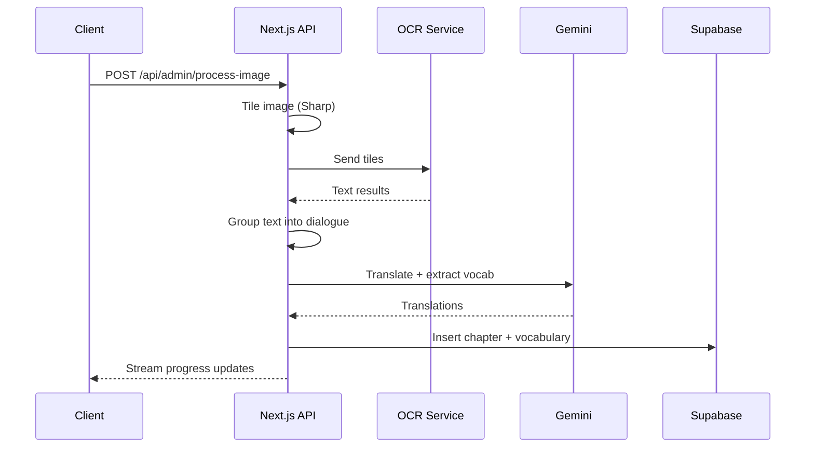

# Pipeline Migration: Encore to Next.js

**Date:** December 23, 2025
**Status:** Planning
**Goal:** Migrate image-to-words pipeline from Encore to Next.js API routes

---

## Background

The Encore-based OCR pipeline has become difficult to maintain due to:
- Deployment issues
- API call failures between services
- OCR dependency problems
- Separate codebase overhead

The pipeline logic itself is sound - it worked previously. The issues are
infrastructure/platform friction, not algorithmic bugs.

---

## Decision

**Rebuild in Next.js** rather than debug Encore.

Rationale:
- Only port code actually in use (strip excess)
- Understand every line (no mystery code)
- Test incrementally as we build
- Single codebase, simpler deployment

---

## Pipeline Overview

```
Image -> Tile -> OCR -> Group Text -> Translate -> Insert DB
```



### Processing Time

- **Total:** 30-60s across all tiles
- **Per tile:** ~2-5s each
- **Conclusion:** Well within serverless limits, streaming viable

---

## Architecture Decision

### Option A: Streaming Response (Selected)

Use Server-Sent Events to stream progress to client.

```
POST /api/admin/process-image (streaming)
  -> Tile (10%)
  -> OCR (40%)
  -> Group (50%)
  -> Translate (80%)
  -> Insert (100%)
```

**Pros:**
- Simple implementation
- No external dependencies
- Good UX with real-time progress

**Cons:**
- Constrained by Vercel's 60s limit (acceptable for our use case)

### Alternatives Considered

**Option B: Job Queue (Inngest/Trigger.dev)**
- Pros: No timeout issues, reliable retries
- Cons: Additional service, more complexity
- Status: Fallback if streaming proves insufficient

**Option C: Chunked Polling**
- Pros: Works within limits, resumable
- Cons: More complex client logic
- Status: Not needed given timing constraints

---

## File Structure

### Pipeline Modules

```
src/lib/pipeline/
  index.ts           # Orchestration - main entry point
  tiling.ts          # Sharp image splitting
  ocr.ts             # OCR service integration
  textGrouper.ts     # Dialogue grouping logic
  translator.ts      # Gemini translation
  dbInserter.ts      # Supabase vocab/chapter insert
  types.ts           # Shared types for pipeline
```

### Tests

```
src/lib/pipeline/__tests__/
  tiling.test.ts       # Unit: tile dimensions, edge cases
  ocr.test.ts          # Unit: mocked OCR responses
  textGrouper.test.ts  # Unit: grouping algorithms
  translator.test.ts   # Unit: mocked Gemini responses
  dbInserter.test.ts   # Unit: DB operations
  integration.test.ts  # E2E: full pipeline
```

### Fixtures

```
src/lib/pipeline/__fixtures__/
  sample-webtoon.png   # Test image
  ocr-response.json    # Mocked OCR output
  gemini-response.json # Mocked translation output
```

### API Route Update

```
src/app/api/admin/process-image/
  route.ts             # Update to use local pipeline + streaming
```

---

## Implementation Order

Each module is implemented then tested before moving to the next.

### Phase 1: Core Pipeline

| Step | Module | Description | Test |
|------|--------|-------------|------|
| 1 | tiling.ts | Sharp image splitting | tiling.test.ts |
| 2 | ocr.ts | OCR service integration | ocr.test.ts |
| 3 | textGrouper.ts | Dialogue grouping | textGrouper.test.ts |
| 4 | translator.ts | Gemini translation | translator.test.ts |
| 5 | dbInserter.ts | Supabase insert | dbInserter.test.ts |

### Phase 2: Integration

| Step | Task | Description |
|------|------|-------------|
| 6 | index.ts | Orchestrate all modules |
| 7 | integration.test.ts | E2E test with all mocks |
| 8 | route.ts | Update API to use pipeline + streaming |
| 9 | Admin UI | Add progress indicator |

---

## Module Specifications

### types.ts

**Purpose:** Shared type definitions for pipeline

**Types:**
- `BoundingBox` - Rectangle coordinates (x, y, width, height)
- `OcrResult` - Text with bounding box
- `OcrResultWithContext` - OCR result with tile context for filtering
- `TileContext` - Bounding box of source tile

**Source:** Direct copy from `webtoon2anki3/backend/services/types.ts`

---

### tiling.ts

**Purpose:** Split tall webtoon images into processable tiles

**Input:**
- `image: Buffer` - Original image data
- `config: TilingConfig` - Threshold, overlap percentage

**Output:**
- `{ tile: sharp.Sharp, startY: number }[]` - Array of tile objects

**Dependencies:**
- `sharp` - Image processing

**Logic (from smartOcrProcessor.createAdaptiveTiles):**
- Check if file size > threshold (1MB default)
- Calculate tile height based on excess ratio
- Create tiles with 10% overlap
- Include `filterOcrResults` to deduplicate overlapping text

**Key Algorithm:**
```
excessRatio = fileSize / threshold
baseDivisions = ceil(excessRatio)
tileHeight = floor(imgHeight / baseDivisions)
```

---

### ocrUtils.ts

**Purpose:** Utility functions for OCR processing

**Functions:**
- `getImageInfo(input)` - Get file size and buffer from path or Buffer
- `mapOcrSpaceResultToOcrResultArray(result)` - Parse OCR.space response
- `handleError(error)` - Categorize and log OCR errors
- `delay(ms)` - Rate limiting helper

**Source:** Direct port from `ocrApiUtils.ts`

---

### ocr.ts

**Purpose:** Main OCR processor with smart tiling

**Input:**
- `image: Buffer` - Image data
- `config?: OCRConfig` - API key, thresholds, language

**Output:**
- `OcrResult[]` - Array of text blocks with coordinates

**Dependencies:**
- `sharp` - Image processing
- `ocr-space-api-wrapper` - OCR.space API (npm package)
- `./tiling.ts` - Tile creation
- `./ocrUtils.ts` - Utilities

**Key Changes from Encore:**
```typescript
// REMOVE:
import log from 'encore.dev/log';
import { secret } from 'encore.dev/config';
const OCR_API_KEY = secret("OCR_API_KEY")();

// REPLACE WITH:
const OCR_API_KEY = process.env.OCR_API_KEY;
// Use console.log/console.error for logging
```

**Logic (from SmartOCRProcessor):**
1. Check file size against threshold
2. If small: process directly with OCR.space
3. If large: create adaptive tiles, OCR each, merge results
4. Adjust tile-relative coords to absolute coords
5. Filter duplicates from overlapping regions

---

### textGrouper.ts

**Purpose:** Group OCR text blocks into dialogue/speech bubbles

**Input:**
- `textBlocks: TextBlock[]` - Raw OCR output

**Output:**
- `Dialogue[]` - Grouped dialogue with context

**Dependencies:**
- None (pure logic)

**Logic:**
- Cluster text blocks by spatial proximity
- Order by reading direction (top-to-bottom, right-to-left for manhwa)
- Merge related blocks into single dialogue units

---

### translator.ts

**Purpose:** Translate Korean dialogue and extract vocabulary

**Input:**
- `dialogue: Dialogue[]` - Grouped Korean text

**Output:**
- `TranslatedDialogue[]` - With English translation
- `Vocabulary[]` - Extracted words with definitions

**Dependencies:**
- Gemini API

**Logic:**
- Batch dialogues into efficient API calls
- Prompt Gemini for translation + vocab extraction
- Parse structured response

---

### dbInserter.ts

**Purpose:** Store chapter and vocabulary in Supabase

**Input:**
- `seriesSlug: string`
- `chapterNumber: number`
- `vocabulary: Vocabulary[]`

**Output:**
- `{ newWordsInserted: number, totalWordsInChapter: number }`

**Dependencies:**
- Supabase client (already configured)

**Logic:**
- Create/update chapter record
- Upsert vocabulary (skip duplicates)
- Link vocabulary to chapter

---

## Testing Strategy

### Unit Tests

| Module | Mocked | Real |
|--------|--------|------|
| tiling | - | Sharp (real image processing) |
| ocr | OCR service responses | HTTP client |
| textGrouper | - | Pure logic, no mocks needed |
| translator | Gemini API | - |
| dbInserter | Supabase client | - |

### Integration Test

- Uses all mocked external services
- Verifies full pipeline flow
- Tests error handling at each stage

---

## Dependencies to Install

```bash
npm install sharp ocr-space-api-wrapper
```

| Package | Version | Purpose |
|---------|---------|---------|
| `sharp` | latest | Image tiling and processing |
| `ocr-space-api-wrapper` | latest | OCR.space API integration |

---

## Environment Variables

```env
# Existing
NEXT_PUBLIC_SUPABASE_URL=xxx
NEXT_PUBLIC_SUPABASE_PUBLISHABLE_KEY=xxx

# New - OCR
OCR_API_KEY=xxx              # OCR.space API key

# New - Translation
GEMINI_API_KEY=xxx           # Google Gemini API key
```

---

## Risks and Mitigations

| Risk | Likelihood | Impact | Mitigation |
|------|------------|--------|------------|
| Vercel 60s timeout exceeded | Low | High | Monitor timing; upgrade to Inngest if needed |
| OCR service rate limits | Medium | Medium | Implement backoff; process tiles sequentially |
| Large image memory issues | Low | Medium | Stream tiles; don't load full image |
| Gemini API changes | Low | Low | Abstract behind translator module |

---

## Success Criteria

1. Full pipeline runs in Next.js without Encore dependency
2. All unit tests pass
3. Integration test passes
4. Processing time comparable to Encore (~30-60s)
5. Admin UI shows real-time progress

---

## Open Questions

1. ~~Which OCR service is being used?~~ **Resolved: OCR.space API**
2. Existing Gemini prompt structure to preserve?
3. Any specific text grouping logic from old code?

---

## Source Code Reference

Original Encore files to port from:

```
webtoon2anki3/backend/services/
  types.ts                    # Type definitions
  ocr-api/
    smartOcrProcessor.ts      # Main processor + tiling
    ocrApiUtils.ts            # Utility functions
    index.ts                  # Entry point
    test/
      ocrApi.test.ts          # Tests to adapt
```

---

## Code Reuse Strategy

### Worth Copying (Core Logic)

| Code | Location | Why Keep |
|------|----------|----------|
| `createAdaptiveTiles` algorithm | smartOcrProcessor.ts:334-399 | Clever sizing based on file ratio, overlap works |
| `mapOcrSpaceResultToOcrResultArray` | ocrApiUtils.ts:32-57 | Clean parsing of OCR.space response |
| `filterOcrResults` | smartOcrProcessor.ts:401-424 | Smart dedup using distance from tile edges |
| Coordinate adjustment | smartOcrProcessor.ts:261-270 | Correct math for absolute positioning |
| Type definitions | types.ts | Clean, minimal types |

### Worth Replacing/Simplifying

| Code | Location | Why Replace |
|------|----------|-------------|
| `getImageInfo` with fs.access | ocrApiUtils.ts:10-26 | Next.js receives Buffers only, not paths |
| Temp file creation/cleanup | smartOcrProcessor.ts:68-139 | Work with Buffers in memory |
| `handleError` if/else chain | ocrApiUtils.ts:62-86 | Simpler error handling, just throw |
| Class-based structure | smartOcrProcessor.ts | Convert to pure functions |
| Engine switching retry | smartOcrProcessor.ts:109-121 | Dead code, remove |
| `batchOCRProcessing` | index.ts:41-97 | Not needed for single upload |

### Simplification

Encore handles both file paths and Buffers. Next.js only receives Buffers:

```typescript
// BEFORE (Encore)
async processImage(input: string | Buffer)

// AFTER (Next.js) - Buffer only
async processImage(image: Buffer): Promise<OcrResult[]>
```

### Migration Strategy Per File

| Source File | Strategy | Reuse % |
|-------------|----------|---------|
| `types.ts` | Copy directly | 100% |
| `ocrApiUtils.ts` | Copy `mapOcrSpaceResult` + `delay` only | 40% |
| `smartOcrProcessor.ts` | Extract algorithms, rewrite as functions | 60% |
| `index.ts` | Skip, merge into ocr.ts | 0% |

**Summary:** Copy algorithms, rewrite structure. ~60% logic reuse, cleaner architecture.

---

## Related Documentation

- [Admin Upload Implementation](../learnings/admin-upload-implementation.md)
- [Admin Workflow](../admin-workflow.md)
- [API Documentation](../api-documentation.md)

