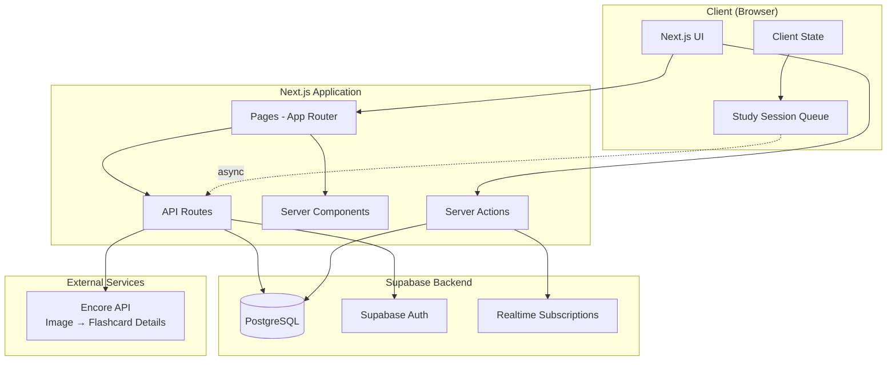
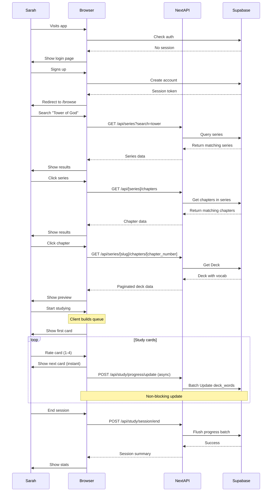
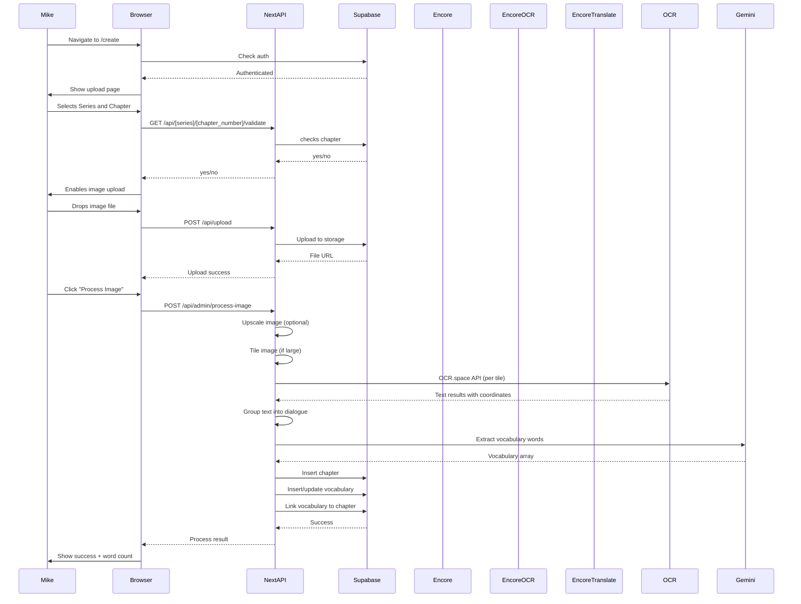

# AnkiToon Rebuild - Comprehensive Documentation

**Project:** AnkiToon (formerly Webtoon2Anki)  
**Purpose:** Korean language learning platform via webtoon vocabulary flashcards  
**Rebuild:** Next.js 14+ with Supabase, preserving backend services  
**Date:** December 2025
**Version:** 3.0

---

## Table of Contents

1. [Project Overview](#project-overview)
2. [Existing Codebase Analysis](#existing-codebase-analysis)
3. [Architecture & Data Model](#architecture--data-model)
4. [User Stories & Journeys](#user-stories--journeys)
5. [Implementation Patterns](./implementation-patterns.md)
6. [Setup Guide](#setup-guide)
7. [Type Definitions](./schema-type-definitions.md#type-definitions)
8. [Database Schema](./schema-type-definitions.md#database-schema)
9. [API Reference](./api-documentation.md)

---

## Project Overview

### What is AnkiToon?

AnkiToon is a language learning platform that enables users to study Korean vocabulary through:

- **Pre-made decks** generated from popular webtoon series
- **Custom deck creation** by uploading webtoon screenshots
- **Spaced repetition study** using FSRS algorithm
- **Progress tracking** with analytics dashboard
- **Series management** organized by webtoon titles

### Current State

The existing project includes:
- Old Repository [Docs](https://github.com/gwarren3210/webtoon2anki3) [Backend](https://github.com/gwarren3210/webtoon2anki3-backend) [Frontend](https://github.com/gwarren3210/flash-toon-ai) 
- CLI tool (`w2a`) for deck/series/study management
- Encore.ts backend services (OCR, translation, text grouping)
- Supabase database schema with SRS tracking
- Comprehensive SRS algorithm research and implementation
- Migration files for PostgreSQL database

### Rebuild Goals

- Modern Next.js 14+ web application with App Router
- Supabase for database, auth, storage, and edge functions
- Preserve valuable backend services (OCR, translation)
- Reuse database schema and business logic
- Fresh start (no data migration)

---

## Existing Codebase Analysis

### Valuable Files & Folders to Preserve

#### High Value - Reuse Directly

**Database Migrations** (`/migrations/`)

1. **`2025-08-13_rpc.sql`** - RPC function for chapter cards
   - `get_chapter_cards()` function
   - Joins series, chapters, words, fsrs_progress

**TypeScript Types** (`/cli/types/index.ts`)

```typescript
export type Series = {
  id: string;
  title: string;
  genre?: string;
  language?: string;
  createdAt: string;
};

export type Chapter = {
  id: string;
  seriesId: string;
  number: number;
  title?: string;
  sourceFile?: string;
  private?: boolean;
  difficulty?: string;
  unlocked: boolean;
  createdAt: string;
};

export type Card = {
  id: string;
  chapterId: string;
  word: string;
  definition: string;
  romanization?: string;
  example?: string;
  createdAt: string;
};

export type User = {
  id: string;
  username: string;
  email?: string;
  avatar?: string;
  guest?: boolean;
  createdAt: string;
};

export type Deck = {
  id: string;
  title: string;
  genre?: string;
  difficulty?: string;
  status?: string;
  featured?: string[];
  createdAt: string;
};

```
Study session flow:
1. Start session → load queues by state
2. Present card from appropriate queue
3. User rates card (1-4)
4. **Immediately show next card** (optimistic UI)
5. **Async update** FSRS progress in background
6. End session → save remaining progress

#### Medium Value - Adapt & Refactor

**CLI Command Patterns**

These files contain solid business logic that should inform your API design:

1. **`cli/commands/series.ts`** - Series CRUD
   - List all series
   - Create new series
   - Search by query
   - API pattern: `GET /supabase/series`, `POST /supabase/series`

2. **`cli/commands/deck.ts`** - Deck management
   - List decks with filters
   - Create deck from chapter
   - View deck details with cards
   - Get due cards for review
   - Feature/badge system

3. **`cli/commands/card.ts`** - Vocabulary operations
   - Add cards to chapter
   - Edit card definitions
   - Delete cards
   - List cards for chapter

4. **`cli/commands/chapter.ts`** - Chapter management
   - Add chapter to series
   - List chapters for series

5. **`cli/commands/user.ts`** - User operations
   - Create user
   - Login simulation
   - View progress
   - Reset progress

6. **`cli/commands/study.ts`** - Study session logic
   - Session state management
   - Queue-based card presentation
   - Rating submission
   - Progress tracking

**Key patterns to extract:**

```typescript
// API request wrapper
async function apiRequest(method, path, data, options) {
  const response = await fetch(baseUrl + path, {
    method,
    headers: { 'Content-Type': 'application/json' },
    body: data ? JSON.stringify(data) : undefined
  })
  return response.json()
}

// Output formatting (adapt for web UI)
function printTable(data) {
  // Convert to table component
}

function printJson(data) {
  // Convert to JSON viewer component
}
```

**Documentation Files**

Valuable context and decisions:

- **`.cursor/PRD.md`** - Product requirements, target users, success metrics
- **`.cursor/docs/30-srs-algorithm-research.md`** - Extensive SRS research
- **`.cursor/docs/34-srs-algorithm-design-decisions.md`** - Why certain choices were made
- **`.cursor/docs/27-project-context-and-history.md`** - Development history
- **`.cursor/docs/29-feature-roadmap-and-prioritization.md`** - Future features
- **`.cursor/new-stories.md`** - Additional user stories for future

**Backend Service Structure** (`/backend/`)

Services to keep running separately:

```
backend/
├── services/
│   ├── ocr-api/          # Google Cloud Vision integration
│   ├── translation/      # Papago translation engine
│   ├── text-grouper/     # Dialogue extraction from OCR
│   ├── anki/             # Anki package generation (deprecated)
│   ├── storage/          # Temp file storage
│   └── validation/       # File validation
```

**Keep these Encore services:**
- OCR processing (complex image processing pipeline)
- Translation (Papago API integration)
- Text grouping (speech bubble detection)

**Deprecate/replace:**
- Anki package generation (no longer needed)
- File validation (Next.js can handle)
- Storage service (use Supabase Storage)

#### Low Value - Recreate for Web

- CLI infrastructure (Commander, Inquirer) (depricated)
- Terminal output formatting
- Config file management (replace with env vars)
- Old API client (Axios → modern fetch/SWR)

---

## Architecture & Data Model

### System Architecture



---

## User Stories & Journeys

### Complete User Stories by Feature

#### Study Mode (Priority 1)

1. **As a learner**, I want to study vocabulary using spaced repetition so I can efficiently retain what I learn
   - Acceptance: FSRS algorithm schedules cards based on performance
   - Acceptance: Cards appear at optimal intervals for retention

2. **As a student**, I want to see my progress during study sessions so I stay motivated
   - Acceptance: Progress bar shows cards completed / total and updates during study session
   - Acceptance: Real-time count of cards in each state (new/learning/review)

3. **As a user**, I want smooth card flip animations so the study experience feels natural
   - Acceptance: 60fps flip animation when revealing answer
   - Acceptance: No lag between rating and next card

4. **As a learner**, I want to rate cards 1-4 based on difficulty so the algorithm can optimize my reviews
   - Acceptance: 4 rating buttons clearly labeled (Again/Hard/Good/Easy)
   - Acceptance: Immediate visual feedback on rating selection

5. **As a student**, I want to see session summaries so I can track my performance
   - Acceptance: End-of-session shows cards reviewed, average rating, time spent
   - Acceptance: Breakdown by rating type

6. **As a user**, I want instant card transitions so my study flow isn't interrupted
   - Acceptance: Next card appears immediately after rating
   - Acceptance: Progress updates happen in background (async)

7. **As a learner**, I want keyboard shortcuts for rating so I can study efficiently
   - Acceptance: Keys 1-4 rate the current card
   - Acceptance: Space bar flips the card

#### Deck Discovery (Priority 2)

8. **As a user**, I want to browse decks by series so I can find content from my favorite webtoons
   - Acceptance: Series organized with cover images
   - Acceptance: Click series to see available decks

9. **As a learner**, I want to filter decks by difficulty so I find appropriate content for my level
   - Acceptance: Filter options: beginner, intermediate, advanced
   - Acceptance: Difficulty indicator on each deck card

10. **As a student**, I want to see deck metadata before starting
    - Acceptance: Word count displayed
    - Acceptance: Estimated study time shown
    - Acceptance: Preview of first 5 words

11. **As a user**, I want to search for specific series or vocabulary themes
    - Acceptance: Search bar filters results in real-time
    - Acceptance: Search by series name, genre, or keywords

12. **As a learner**, I want to see which decks I've already studied
    - Acceptance: "In Progress" badge on started decks
    - Acceptance: Progress percentage displayed

#### Deck Creation (Priority 3)

13. **As a user**, I want to upload webtoon screenshots so I can create custom vocabulary decks
    - Acceptance: Drag-and-drop upload area
    - Acceptance: Supports PNG, JPG, WEBP formats

14. **As a creator**, I want OCR to extract Korean text automatically

15. **As a learner**, I want translations generated automatically
    - Acceptance: English translations for all Korean words
    - Acceptance: Editable translation fields

#### Progress Tracking (Priority 4)

16. **As a student**, I want to see my overall progress on a dashboard
    - Acceptance: Total words learned count
    - Acceptance: Mastery rate percentage
    - Acceptance: Current streak display

17. **As a learner**, I want to track my study streak
    - Acceptance: Days studied in a row
    - Acceptance: Visual calendar heatmap
    - Acceptance: Streak goal setting

18. **As a user**, I want to see which series I've studied most
    - Acceptance: Top 5 series by cards reviewed
    - Acceptance: Time spent per series
    - Acceptance: Click to see series details

19. **As a student**, I want to see upcoming reviews
    - Acceptance: Cards due today/this week
    - Acceptance: Estimated review time
    - Acceptance: Quick start button for review session

#### Series Management (Priority 5)

20. **As a user**, I want to see all available series with cover images
    - Acceptance: Grid layout with series covers
    - Acceptance: Series name and chapter count

21. **As a learner**, I want to see deck availability for each series
    - Acceptance: "X decks available" badge
    - Acceptance: List chapters with/without decks

22. **As a student**, I want to track my progress through a series
    - Acceptance: Chapters completed indicator
    - Acceptance: Overall series progress percentage

28. **As a user**, I want series organized by popularity or genre
    - Acceptance: Sort options: Popular, Recent, A-Z
    - Acceptance: Filter by genre tags
    - Acceptance: Bookmarks/favorites system

### Detailed User Journeys

#### Journey 1: New User Studies Pre-Made Deck

**Actor:** Sarah, intermediate Korean learner  
**Goal:** Study vocabulary from "Tower of God" webtoon  
**Duration:** 15-20 minutes

**Steps:**

1. **Landing & Auth (2 min)**
   - Sarah visits ankitoon.com
   - Clicks "Sign Up" with email/password
   - Supabase creates account, redirects to browse page
   - If login cached, automatically redirects to browse page

2. **Discovery (3 min)**
   - Browse page shows popular series with cover images
   - Sarah searches "Tower of God" in search bar
   - Results show matching series
   - Clicks on the correct series, redirects to series page
   - Clicks "Chapter 1" deck card to see details or start learning

3. **Deck Preview (2 min)**
   - Deck detail page shows:
     - Difficulty
     - Preview of first 25 words
     - "Start Studying" button prominent
   - Sarah clicks "Start Studying"

4. **Study Session (10 min)**
   - Study page loads with first card
   - Card shows Korean word: "탑" (front)
   - Sarah thinks about meaning, clicks card to flip
   - Card reveals: "tower" (back)
   - Sarah rates it "Good" (3)
   - **Next card appears instantly** (optimistic UI)
   - **Progress updates in background** (async)
   - Progress bar updates: "1 / total"
   - Cards left panel shows: New: 49, Learning: 1 Reviewing: 0, Mastered: 0
   - Repeats for 20 cards (new user session limit)

5. **Session Summary (1 min)**
   - "Great session!" message
   - Stats displayed:
     - 20 cards reviewed
     - Average rating: 2.8
     - Time: 8 minutes
     - Next review: X cards due tomorrow
   - "Continue Tomorrow" button
   - Sarah feels accomplished, closes app

**Technical Flow:**



#### Journey 2: Creating Custom Deck from Screenshot

**Actor:** Mike, advanced learner creating study material  
**Goal:** Create deck from a new webtoon chapter  
**Duration:** 10-15 minutes

**Steps:**

1. **Navigate to Create (1 min)**
   - Mike logs in to his account
   - Clicks "Create Deck" in navigation
   - Lands on upload page

2. **Image Upload (2 min)**
   - Selects series from dropdown: "Solo Leveling"
   - Selects chapter: "Chapter 15"
   - Check chapter is not already in Databsebase
   - Drag-and-drop interface shows
   - Mike drops webtoon screenshot
   - Image uploads to Supabase Storage
   - Preview displays uploaded image
   - "Process Image" button enabled

3. **OCR Processing, Translation, Deck Creation (1 min)**
   - Mike clicks "Process Image"
   - API proxies to Encore OCR service
   - API proxies to Encore translation service
   - Translation service resolves noise and solves homograph problem
   - Inserts into Database

7. **Confirmation & Start (1 min)**
   - Success message: "Deck created!"
   - "Start Studying" and "View Deck" buttons
   - Mike clicks "Start Studying"
   - First card loads, session begins

**Technical Flow:**



#### Journey 3: Tracking Progress

**Actor:** Lisa, consistent learner checking stats  
**Goal:** Review learning progress and plan next study  
**Duration:** 5 minutes

**Steps:**

1. **Navigate to Progress (30 sec)**
   - Lisa logs in
   - Clicks "Progress" in navigation
   - Dashboard loads

2. **Overview Stats (1 min)**
   - Top section shows:
     - Total words learned: 487
     - Words mastered: 203 (42%)
     - Current streak: 15 days 🔥
     - Cards due today: 32
   - Lisa feels motivated by streak

3. **Progress Charts (2 min)**
   - Line chart shows vocabulary growth over 3 months
   - Steady upward trend, small plateau last week
   - Bar chart shows study time per day
   - Last 7 days: [20, 15, 0, 25, 18, 22, 17] minutes
   - Lisa notices missed day, commits to study today

4. **Series Breakdown (1 min)**
   - Top series:
     1. Tower of God - 156 words, 8 hours
     2. Solo Leveling - 142 words, 7 hours
     3. The Breaker - 98 words, 5 hours
   - Lisa clicks "Tower of God"
   - Shows per-chapter progress

5. **Upcoming Reviews (30 sec)**
   - "32 cards due today" prominent
   - Estimated time: 12 minutes
   - "Start Review" button
   - Lisa clicks, starts session

---

## Setup Guide

### Step 2: Supabase Configuration

```bash
# Create Supabase project
# Visit supabase.com → Create new project

# Install Supabase CLI
brew install supabase/tap/supabase

# Initialize Supabase locally
supabase init

# Link to your project
supabase link --project-ref your-project-ref
```

Create migration files in `supabase/migrations/` (see schema-type-definitions.md for SQL).

Run migrations:

```bash
supabase db push
```

### Step 3: Environment Variables

```env
# .env.local

NEXT_PUBLIC_SUPABASE_URL=https://your-project.supabase.co
NEXT_PUBLIC_SUPABASE_PUBLISHABLE_KEY=publishable_keu

# Encore backend services (keep running)
ENCORE_URL=https://your-encore.app
```

### Step 4: Type Generation

```bash
# Generate TypeScript types from Supabase
npx supabase gen types typescript --project-id your-project-ref > src/types/database.types.ts
```

### Step 5: Authentication Setup

```typescript
// src/app/login/page.tsx

'use client'

import { useState } from 'react'
import { createClient } from '@/lib/supabase'
import { useRouter } from 'next/navigation'

export default function LoginPage() {
  const [email, setEmail] = useState('')
  const [password, setPassword] = useState('')
  const router = useRouter()
  const supabase = createClient()
  
  const handleLogin = async (e: React.FormEvent) => {
    e.preventDefault()
    
    const { data, error } = await supabase.auth.signInWithPassword({
      email,
      password
    })
    
    if (error) {
      alert(error.message)
      return
    }
    
    router.push('/browse')
  }
  
  return (
    <form onSubmit={handleLogin}>
      {/* Login form */}
    </form>
  )
}
```

### Step 6: Seed Data

```sql
-- supabase/seed.sql

-- Insert sample series
INSERT INTO series (name, slug, picture, synopsis, popularity, genres) VALUES
('Tower of God', 'tower-of-god', 'https://example.com/tog.jpg', 'Reach the top of the tower...', 9500, '["Action", "Fantasy"]'),
('Solo Leveling', 'solo-leveling', 'https://example.com/sl.jpg', 'Weakest hunter becomes strongest...', 9800, '["Action", "Fantasy"]');

-- Insert sample chapters
INSERT INTO chapters (series_id, chapter_number, title)
SELECT id, '1', 'Chapter 1' FROM series WHERE slug = 'tower-of-god';

-- Insert sample words
INSERT INTO words (word, definition, pronunciation) VALUES
('탑', 'tower', 'tap'),
('시험', 'test', 'siheom'),
('친구', 'friend', 'chingu');
```

```bash
supabase db seed
```

### Step 7: Proxy Backend Services

```typescript
// src/app/api/process/route.ts

import { NextResponse } from 'next/server'

export async function POST(request: Request) {
  const formData = await request.formData()
  const image = formData.get('image')
  
  // Forward to Encore OCR + Translation service
  const response = await fetch(`${process.env.ENCORE_URL}/process`, {
    method: 'POST',
    body: image,
    headers: {
      'Content-Type': 'image/jpeg'
    }
  })
  
  const result = await response.json()
  return NextResponse.json(result)
}
```

### Step 8: Build First Feature

Start with deck browsing:

```typescript
// src/app/browse/page.tsx

import { createServerClient } from '@/lib/supabase'
import { SeriesGrid } from '@/components/SeriesGrid'

export default async function BrowsePage() {
  const supabase = await createServerClient()
  
  const { data: series } = await supabase
    .from('series')
    .select('*')
    .order('popularity', { ascending: false })
    .limit(20)
  
  return (
    <div>
      <h1>Browse Series</h1>
      <SeriesGrid series={series || []} />
    </div>
  )
}
```

---

## Next Steps

### Step 1: Project Setup

1. **Set up Next.js project** following Step 1-3 of Setup Guide
2. **Run database migrations** in Supabase
3. **Seed sample data** for testing
4. **Build authentication** pages (login/signup)
5. **Create app layout** with navigation

### Step 2: Foundation

- Complete project setup and configuration
- Implement authentication flow
- Create base layout and navigation
- Set up Tailwind + shadcn/ui components
- Build series browsing page (read-only)

### Step 3: Deck Browsing

- Deck listing with filters
- Deck detail view
- Series detail pages
- Search functionality
- Responsive design

### Step 4: Study Mode

- FSRS algorithm service
- Study card component with flip
- Session state management (client-side)
- Rating buttons and keyboard shortcuts
- Async progress updates
- Session summary

### Step 5: Progress Tracking

- Stats dashboard
- Progress charts
- Upcoming reviews
- Activity heatmap
- Per-series breakdowns

### Step 6: Deck Creation

- Image upload component
- OCR result review
- Translation editing
- Vocabulary selection
- Deck creation flow

### Step 7: Polish & Deploy

- Mobile responsive design
- Loading states and error handling
- Performance optimization (image optimization, lazy loading)
- SEO metadata
- Deploy to Vercel + Supabase production
- Test with real users

---

## Conclusion

The key strengths of this redesign:

1. **Preserves valuable code** - Database schema, business logic, FSRS algorithm
2. **Modern tech stack** - Next.js 14, Supabase, TypeScript
3. **Async-first design** - Optimistic UI for smooth study experience
4. **Comprehensive types** - Full TypeScript coverage
5. **Detailed user stories** - Clear understanding of user needs

The rebuild focuses on the core features that provide the most value to users while maintaining the sophisticated FSRS algorithm and backend ocr pipleine service.
