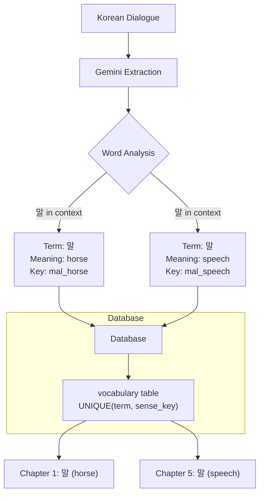

# Sense Key Architecture: Solving Homonym/Synonym Disambiguation

**Date:** December 24, 2025  
**Status:** Implemented  
**Purpose:** Document the homonym/synonym problem and the sense_key solution

---

## The Problem

### Homonyms in Korean

Korean contains many homonyms - words that share the same spelling but have different meanings. When extracting vocabulary from webtoon dialogue, this creates ambiguity:

**Example: 말 (mal)**
- Meaning 1: "horse" (animal)
- Meaning 2: "speech/words" (language)

**Example: 밤 (bam)**
- Meaning 1: "night" (time of day)
- Meaning 2: "chestnut" (food)

**Example: 부상 (busang)**
- Meaning 1: "injury" (wound)
- Meaning 2: "floating" (rising)

### Why This Matters

In a vocabulary learning system like AnkiToon:

1. **Context Loss**: When a word appears in dialogue, the correct meaning depends on context. Without disambiguation, we might store the wrong translation.

2. **Duplicate Prevention**: The database needs to distinguish between different meanings of the same term. A simple unique constraint on `term` would prevent storing multiple valid meanings.

3. **Learning Accuracy**: Users studying vocabulary cards need to see the correct meaning for the context they encountered. Showing "horse" when the dialogue meant "speech" is confusing.

4. **Data Integrity**: Without a way to distinguish meanings, we can't properly track which specific sense of a word appears in which chapters.

### Previous State

Before implementing sense_key:

- The `vocabulary` table had a unique constraint on `term` only
- Gemini API was asked to extract words but could only return one translation per Korean term
- If the same term appeared with different meanings in different chapters, one would overwrite the other
- No way to track that "말" meaning "horse" in Chapter 1 is different from "말" meaning "speech" in Chapter 5

---

## The Solution: Sense Key Architecture

### Concept

A `sense_key` is a short, lowercase, underscore-separated English identifier that uniquely identifies a specific meaning of a Korean word in context. It acts as a disambiguation tag.

### Architecture Overview



### Database Schema

The `vocabulary` table now uses a composite unique constraint:

```sql
CREATE UNIQUE INDEX idx_vocabulary_term_sense 
ON vocabulary(term, sense_key);
```

This allows:
- Same `term` with different `sense_key` values
- Multiple entries for homonyms
- Proper tracking of context-specific meanings

### Sense Key Format

**Naming Convention:**
- Lowercase English
- Underscore-separated
- Format: `{romanization}_{meaning}`

**Examples:**
- `mal_horse` - 말 meaning "horse"
- `mal_speech` - 말 meaning "speech/words"
- `bam_night` - 밤 meaning "night"
- `bam_chestnut` - 밤 meaning "chestnut"
- `busang_injury` - 부상 meaning "injury"
- `busang_floating` - 부상 meaning "floating"

**For non-homonyms:**
- `heonteo_hunter` - 헌터 (only one common meaning)
- `hyeophoe_association` - 협회 (only one common meaning)

---

## Implementation

### 1. Database Migration

**File:** `supabase/migrations/20251224001355_add_sense_key.sql`

```sql
-- Add sense_key column
ALTER TABLE vocabulary 
ADD COLUMN sense_key TEXT NOT NULL DEFAULT 'general';

-- Create unique composite index
CREATE UNIQUE INDEX idx_vocabulary_term_sense 
ON vocabulary(term, sense_key);
```

### 2. Type System

**File:** `src/lib/pipeline/types.ts`

```typescript
export type ExtractedWord = {
  korean: string
  english: string
  importanceScore: number
  senseKey: string  // New field for disambiguation
}
```

### 3. Gemini Prompt

**File:** `src/lib/pipeline/translator.ts`

The extraction prompt now instructs Gemini to:

1. Analyze context for each word
2. Generate a unique `senseKey` for homonyms
3. Use format: `{romanization}_{meaning}`

**Prompt Excerpt:**
```
- senseKey: a short, lowercase, underscore-separated English tag that uniquely 
  identifies this specific meaning. For homonyms (same Korean word, different 
  meanings), use different sense keys. Examples:
  - 말 meaning "horse" -> "mal_horse"
  - 말 meaning "speech/words" -> "mal_speech"
```

### 4. Data Flow

```
1. OCR extracts Korean text from image
2. Text grouper combines into dialogue lines
3. Gemini analyzes dialogue with context
4. For each word:
   - Identifies meaning from context
   - Generates appropriate senseKey
   - Returns: { korean, english, importanceScore, senseKey }
5. Database upsert uses (term, sense_key) as unique key
```

---

## Benefits

### 1. Context Preservation

Each vocabulary entry is tied to its specific meaning in context. When a user reviews a card, they see the translation that matches how the word was used in the webtoon.

### 2. Multiple Meanings Supported

The same Korean term can appear multiple times in the database with different meanings:

```sql
-- Both entries can coexist
INSERT INTO vocabulary (term, sense_key, definition) VALUES
  ('말', 'mal_horse', 'horse'),
  ('말', 'mal_speech', 'speech, words');
```

### 3. Accurate Chapter Linking

When linking vocabulary to chapters via `chapter_vocabulary`, we know exactly which sense of the word appears in that chapter:

```sql
-- Chapter 1 has "말" meaning "horse"
-- Chapter 5 has "말" meaning "speech"
-- Both can be tracked separately
```

### 4. Better Learning Experience

Users can:
- See all meanings of a word they've encountered
- Understand context-specific usage
- Learn that the same spelling can mean different things

### 5. Data Integrity

- No accidental overwrites of valid meanings
- Clear distinction between homonyms
- Proper tracking of word frequency per meaning

---

## Usage Examples

### Example 1: Homonym in Same Chapter

**Dialogue:**
- "그 말이 맞아" (That speech/word is correct)
- "말을 타고 가자" (Let's ride the horse)

**Extracted Words:**
```json
[
  {
    "korean": "말",
    "english": "speech, words",
    "senseKey": "mal_speech",
    "importanceScore": 75
  },
  {
    "korean": "말",
    "english": "horse",
    "senseKey": "mal_horse",
    "importanceScore": 80
  }
]
```

Both entries are stored in the database with different `sense_key` values.

### Example 2: Non-Homonym

**Dialogue:**
- "헌터가 던전에 들어갔다" (The hunter entered the dungeon)

**Extracted Words:**
```json
[
  {
    "korean": "헌터",
    "english": "hunter",
    "senseKey": "heonteo_hunter",
    "importanceScore": 95
  }
]
```

Even though 헌터 has only one common meaning, it still gets a `senseKey` for consistency.

### Example 3: Database Query

```sql
-- Find all meanings of "말"
SELECT term, sense_key, definition 
FROM vocabulary 
WHERE term = '말';

-- Result:
-- 말 | mal_horse    | horse
-- 말 | mal_speech   | speech, words
```

---

## Future Enhancements

### 1. Sense Key Validation

Add validation to ensure `senseKey` format is consistent:
- Enforce lowercase
- Enforce underscore separation
- Validate against known patterns

### 2. Sense Key Standardization

Consider using a standardized sense key format based on:
- WordNet-style sense numbering
- Korean dictionary references
- Community-agreed conventions

### 3. Context Window Analysis

Enhance Gemini prompt to consider:
- Larger context windows (previous/next dialogue lines)
- Visual context from the webtoon panel
- Series-specific terminology

### 4. User Feedback Loop

Allow users to:
- Report incorrect sense_key assignments
- Suggest better sense keys
- Merge duplicate meanings

### 5. Sense Key Migration

For existing vocabulary without `sense_key`:
- Backfill with default `'general'` sense key
- Provide migration script to update existing entries
- Allow admins to manually assign sense keys

---

## Related Files

- **Migration:** `supabase/migrations/20251224001355_add_sense_key.sql`
- **Types:** `src/lib/pipeline/types.ts`
- **Translator:** `src/lib/pipeline/translator.ts`
- **Tests:** `src/lib/pipeline/__tests__/translator.test.ts`
- **Test Data:** `src/lib/pipeline/__tests__/test-data/processed-words.json`

---

## Summary

The sense_key architecture solves the homonym/synonym disambiguation problem by:

1. **Identifying the issue**: Same Korean term can mean different things
2. **Providing a solution**: Unique identifier per meaning via `sense_key`
3. **Implementing systematically**: Database schema, type system, Gemini prompt
4. **Enabling accurate learning**: Users see correct meanings in context

This ensures vocabulary extraction maintains context and provides accurate learning materials for Korean language learners using AnkiToon.

